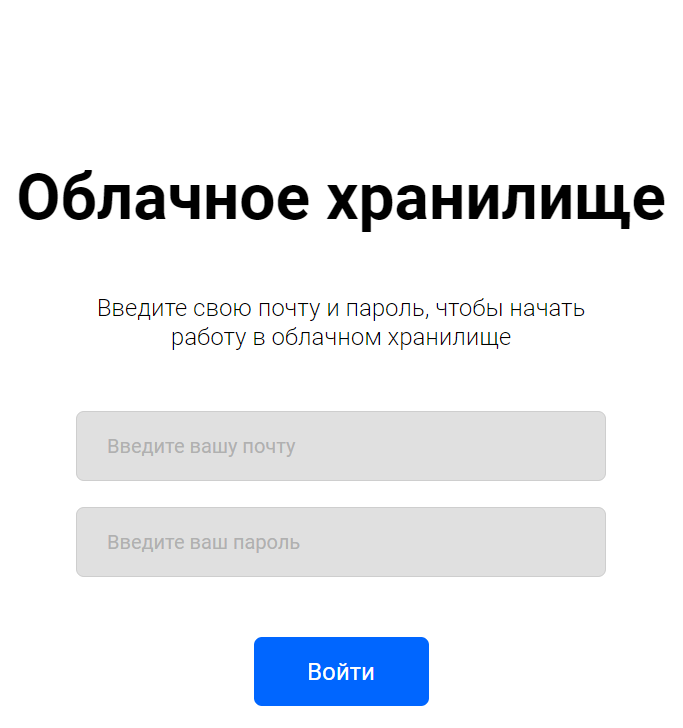
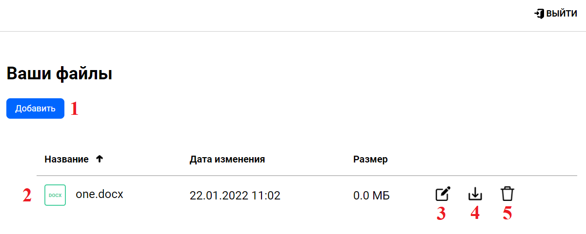
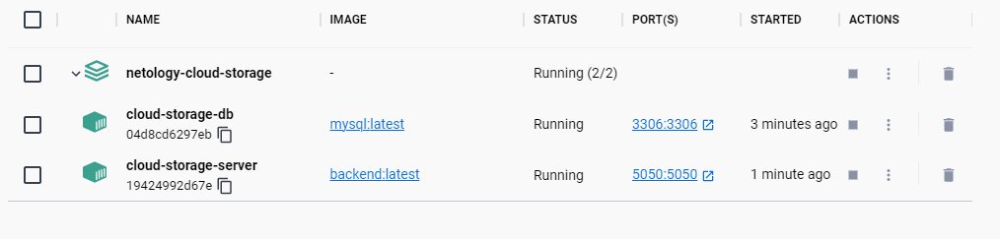

# [“Облачное хранилище”]
## Описание проекта:

REST-сервис предоставляет интерфейс для возможности загрузки файлов и вывода списка уже загруженных файлов пользователя

Все запросы к сервису авторизованы.

Заранее подготовленное веб-приложение (FRONT) подключается к разработанному сервису без доработок,
а также использует функционал FRONT для авторизации, загрузки и вывода списка файлов пользователя.

Данное приложение является сервером, позволяющим пользователям работать с файлами, а именно:
- загружать файлы
- получать файлы по имени
- переименовывать файлы
- удалять файлы
- просматривать список файлов

Изначально FRONT доступен на порту 8080, BACKEND - на порту 5050.

## Стартовые пользователи:

**USERNAME:** user@one.user **PASSWORD:** user_one

**USERNAME:** user@two.user **PASSWORD:** user_two

- Приложение разработано с использованием Spring Boot;
- Использован сборщик пакетов Maven;
- Использована база данных MySql;
- Использована система управления миграциями Liquibase;
- Для запуска используется docker, docker-compose;
- Код размещен на github;
- Код покрыт unit тестами с использованием mockito;
- Добавлены интеграционные тесты с использованием testcontainers;
- Информация о пользователях сервиса хранится в базе данных;
- Информация о файлах пользователей сервиса хранится в базе данных.

## Установка и запуск BACKEND
- Для развертывания в Docker, скачайте [docker-compose.yml] и запустите, набрав из консоли команду: 
>  **docker-compose up**

## Описание и запуск FRONT

- Установите nodejs (версия не ниже 14).
- Скачайте FRONT (JavaScript). https://github.com/netology-code/jd-homeworks/tree/master/diploma/netology-diplom-frontend
- Перейдите в папку FRONT приложения и все команды для запуска выполняйте из неё.
- запустите nodejs-приложение:
> **npm install**

> **npm run serve**

По умолчанию FRONT запускается на порту 8080 и доступен по url в браузере http://localhost:8080.

